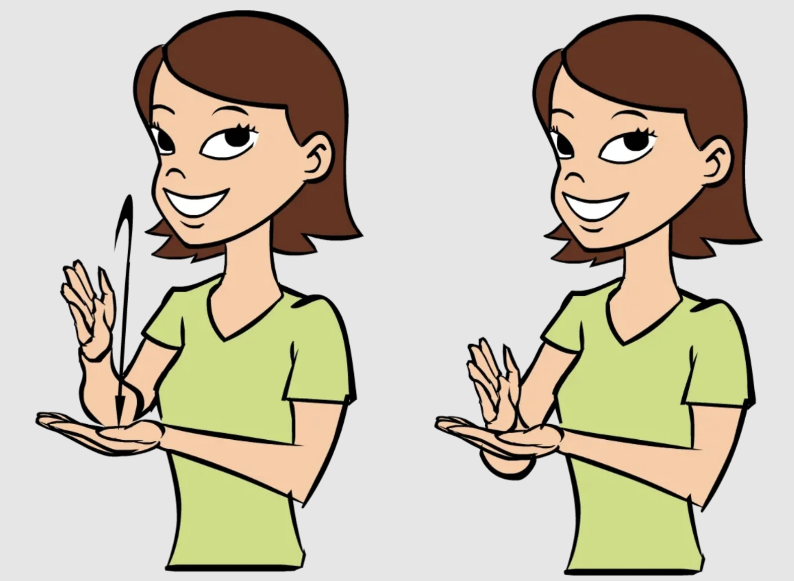
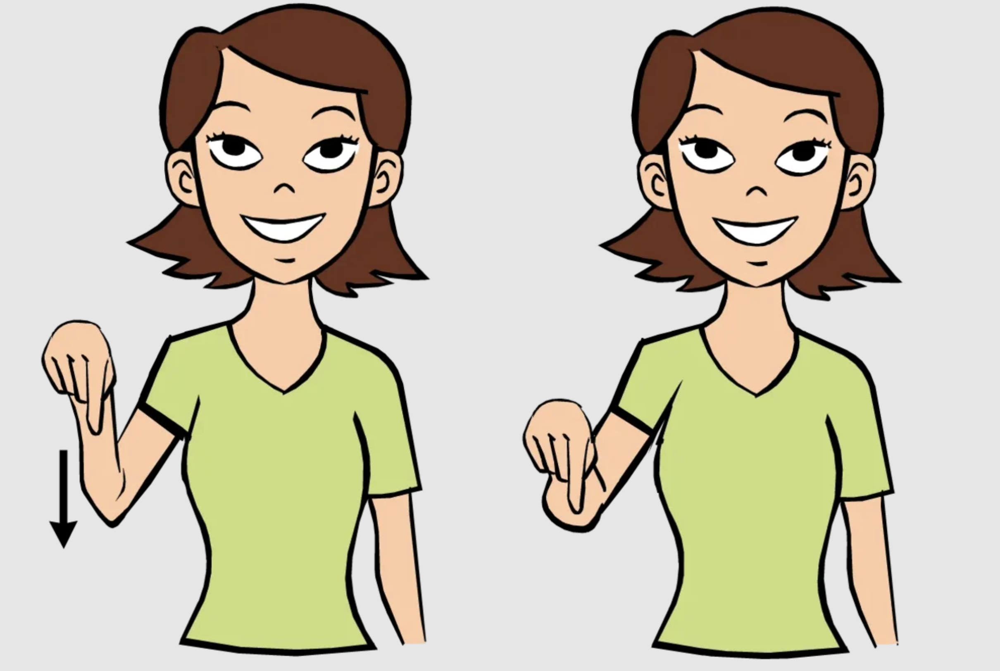
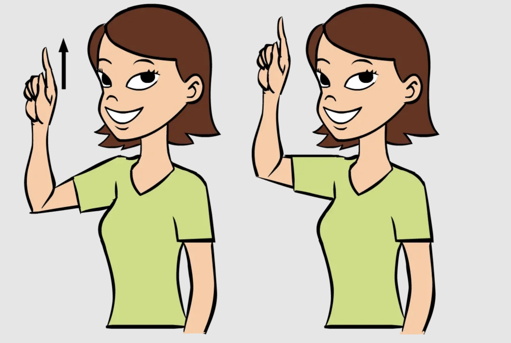
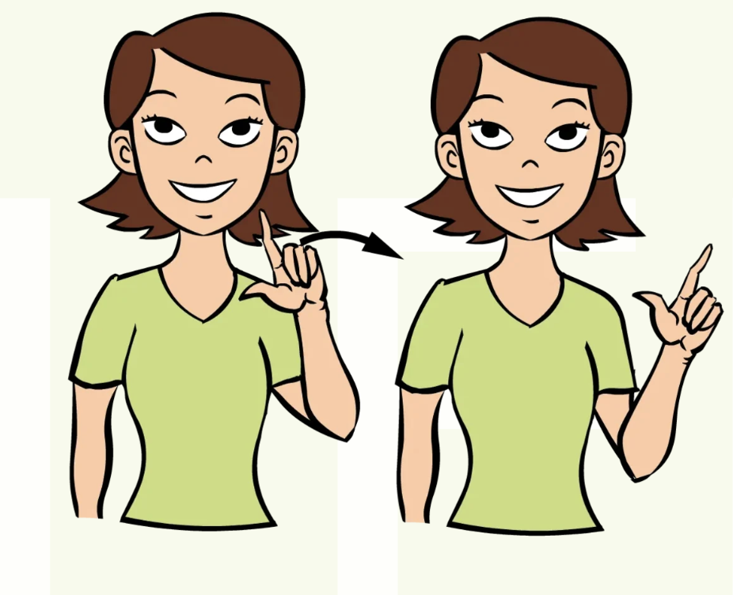
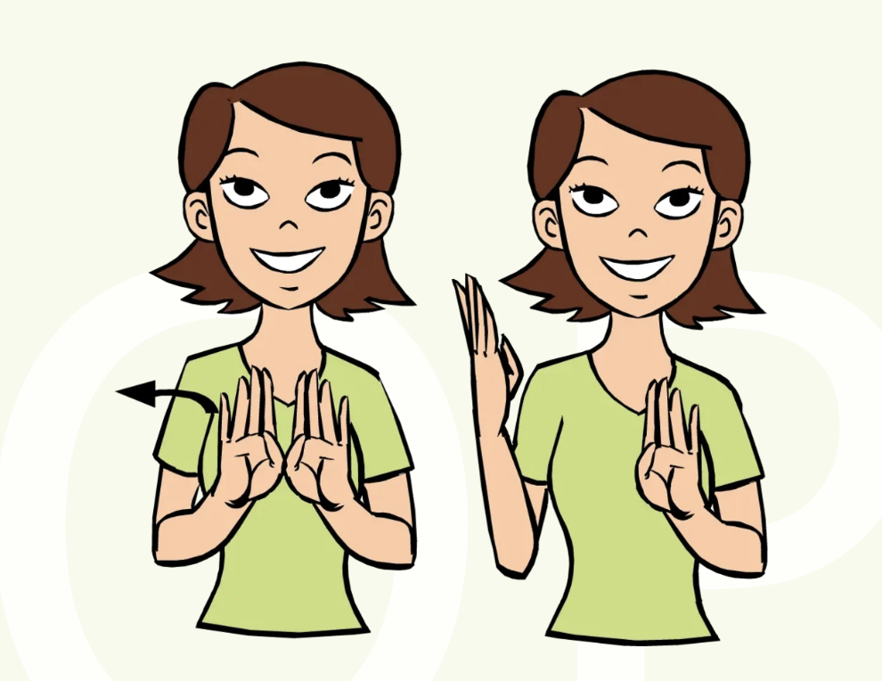
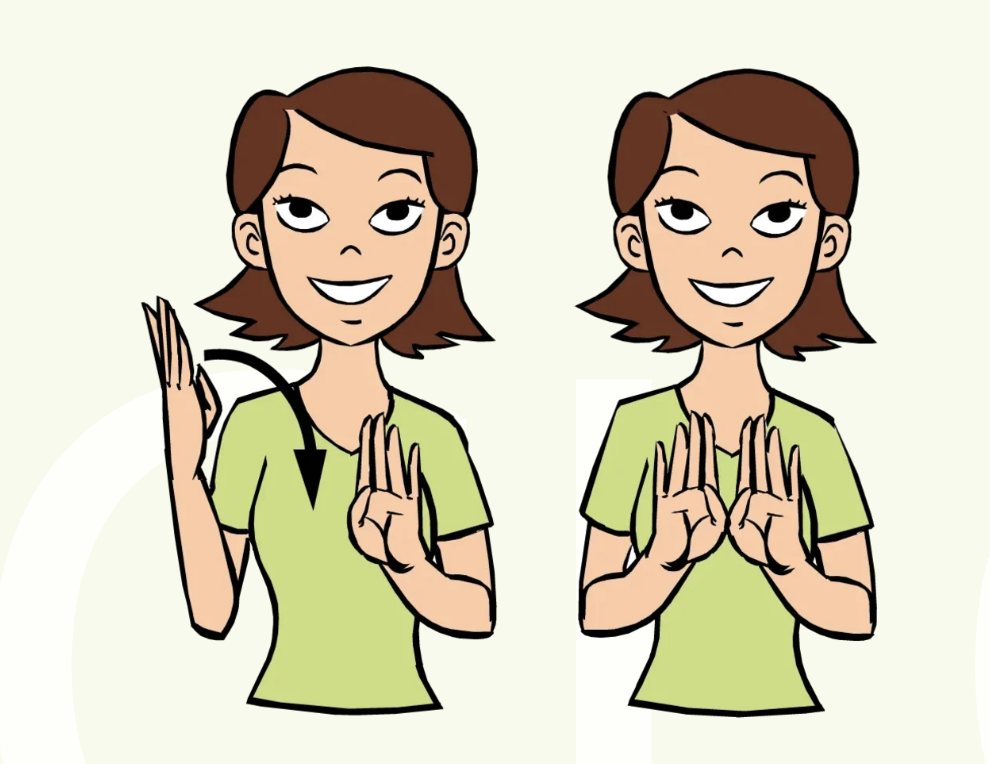

## Plan
1. Install software that can be used to identify the keypoints
2. Create a list of commands that will need to be transcribed
3. Convert the sign language keypoint configurations into text
4. Connect the code to a robot to recieve commands

# ASL to Robot Commands

Team Members:
- Bianca Burgess, biburges@buffalo.edu
- Piyush Salian, psalian@buffalo.edu

--- 

## Project Objective
The goal of this project is to capture the keypoints in the hand, arm and upper body while a person is speaking in ASL. This will then get translated into text which will then send commands to a robot. This way a deaf person can interact with the robot and send it commands using computer vision. 

## ASL/Robot Command Examples
- Stop

- Start

- Down

- Up

- Left

- Right

- Open (Gripper)

- Close (Gripper)

## Contributions
What is unique about this project is that there are lots of people who have created ASL translator devices. This is the glove that detects your hand position and it is connected to a computer that tells you what the person is signing. With this project, it will allow the person to sign to a screen and the computer vision will pick it up the keypoint for it be sent to the robot for its commands.

## Project Plan

### Potential Computer Vision Packages:
MediaPipe

### ASL-to-Text Processing
-NLP models(LSTM/Transformer)
 - Natural Languauge Processing

### Robot Communication
- ROS 2(not sure which robot to use)(simulation or real arm?)

## Milestones/Schedule Checklist
{What are the tasks that you need to complete?  Who is going to do them?  When will they be completed?}
- [X] Complete this proposal document.  *Due Feb. 28*
- [ ] 
- [ ] Create progress report.  *Due April 3*
- [ ] 
- [ ] Create final presentation.  *Due May 6*
- [ ] 
- [ ] Provide system documentation (README.md).  *Due May 13*

## Measures of Success
{How will you know you succeeded?  If you were to receive partial credit, what should we look for?}
